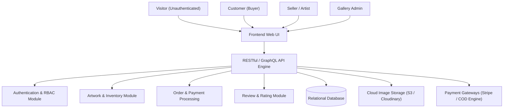
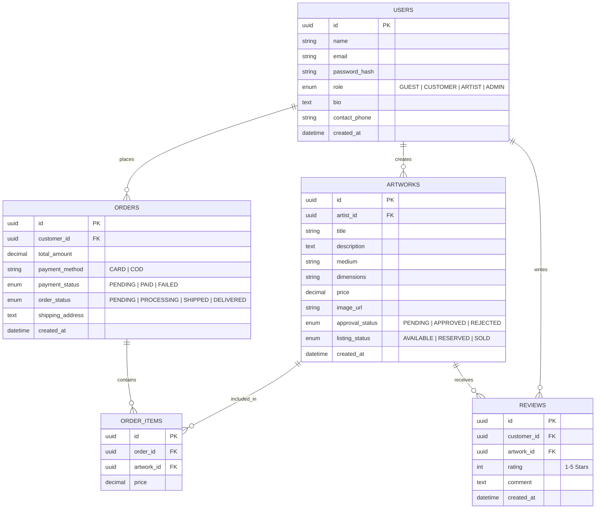

# Software Requirements Specification (SRS)
## Project: Arts Gallery Web Application (SMT-Project)

---

## 1. Introduction

### 1.1 Purpose
This Software Requirements Specification (SRS) document provides a comprehensive overview of the requirements for the **Arts Gallery Web Application**. It outlines the functional and non-functional requirements, target user personas, system architecture, database design principles, and recommended technology stacks. This specification serves as the authoritative blueprint for developers, software architects, QA engineers, and project managers under the **Siesta & Aizen Orchestration Framework**.

### 1.2 Scope
The **Arts Gallery Web Application** is a feature-rich, multi-role digital platform designed to connect visual artists with art collectors, curators, and casual visitors. The application allows artists to exhibit and sell their physical artwork, visitors to explore virtual exhibitions, customers to securely purchase artwork via multiple payment channels, and gallery administrators to curate listings, moderate platform content, and oversee order logistics.

### 1.3 Definitions, Acronyms, and Abbreviations
- **SRS**: Software Requirements Specification
- **RBAC**: Role-Based Access Control
- **COD**: Cash on Delivery
- **JWT**: JSON Web Token
- **ORM**: Object-Relational Mapping
- **UI/UX**: User Interface / User Experience
- **CRUD**: Create, Read, Update, Delete
- **VU**: Virtual University of Pakistan

### 1.4 Project Metadata
- **Project Title**: Arts Gallery Web Application
- **Project Folder**: `SMT-Project`
- **Academic Domain**: Web Application Development
- **Supervisor**: Manahil Hassan (`manahil.hassan@vu.edu.pk`)
- **Orchestration Leads**: Siesta (PM / Coordinator) & Aizen (DevOps & Integration Strategist)

---

## 2. Overall Description

### 2.1 Product Perspective
The Arts Gallery system operates as an independent, self-contained web platform with optional external integrations for payment gateways, cloud image storage, and social media sharing APIs.

### 2.2 User Classes and Characteristics
The application supports four distinct user roles, each with specific permissions and workflows:

1. **Visitor (Unauthenticated Guest)**:
   - *Characteristics*: Casual user browsing artwork without an account.
   - *Capabilities*: View public gallery listings, search artwork by category/artist, read artwork descriptions, share artwork links on social media platforms.
2. **Customer (Registered Buyer)**:
   - *Characteristics*: Account holder looking to purchase artwork pieces.
   - *Capabilities*: Register/login, manage customer profile, save items to cart/wishlist, place orders, complete online or COD payments, track order shipments, write reviews/ratings for purchased pieces.
3. **Seller / Artist (Registered Visual Creator)**:
   - *Characteristics*: Verified artist showcasing and selling creative work.
   - *Capabilities*: Register/login, manage artist biography and contact details, upload new artwork with high-resolution images, edit artwork details, delete listings, update status to `SOLD`, view sales history.
4. **Administrator (Gallery Owner / Manager)**:
   - *Characteristics*: System super-user overseeing operations and content integrity.
   - *Capabilities*: Login with elevated credentials, approve or disapprove artist artwork submissions, manage user accounts (customers & artists), oversee orders, process payouts, update shipping statuses, view analytics reports.

---

## 3. Detailed Functional Requirements

### Module 1: User Authentication & Profile Management
- **FR-1.1 Self-Registration**: System shall allow new Customers and Sellers (Artists) to register by providing name, email, password, and role selection.
- **FR-1.2 Secure Login**: System shall authenticate users via email/password or JWT tokens, issuing role-based credentials.
- **FR-1.3 Profile Management**: Artists can update bio, profile photo, studio address, and contact details. Customers can manage shipping addresses and password changes.
- **FR-1.4 User Administration (Admin)**: Admin can view list of registered users, edit account details, assign privileges, and activate or suspend accounts.

### Module 2: Artwork Management & Curation
- **FR-2.1 Listing Creation**: Sellers can create artwork listings specifying Title, Medium (Oil, Acrylic, Digital, Canvas), Dimensions, Price, Detailed Description, and High-Resolution Image Files.
- **FR-2.2 Listing Maintenance**: Sellers can update pricing, description, or remove listings.
- **FR-2.3 Status Tracking**: Sellers can mark an artwork as `AVAILABLE`, `RESERVED`, or `SOLD`.
- **FR-2.4 Admin Approval Pipeline**: Newly created artwork listings are placed in a pending queue until approved or rejected by an Admin based on guidelines.

### Module 3: Gallery Browsing & Search Engine
- **FR-3.1 Gallery View**: Responsive grid view of all approved artwork with title, thumbnail, artist name, price tag, and status pill.
- **FR-3.2 Keyword & Attribute Search**: Search artwork by keyword, title, artist name, medium, price range slider, and availability status.
- **FR-3.3 Social Media Link Sharing**: Direct social sharing buttons (Facebook, Twitter/X, Pinterest, WhatsApp) for every artwork detail page.

### Module 4: E-Commerce, Order & Payment Processing
- **FR-4.1 Shopping Cart**: Customers can add available artwork to a persistent shopping cart, modify selection, and view price subtotals.
- **FR-4.2 Checkout Engine**: Checkout process collecting shipping address, delivery preferences, and payment details.
- **FR-4.3 Payment Gateway Support**: Support for Online Credit/Debit Card payments (Stripe/PayPal API) and Cash on Delivery (COD).
- **FR-4.4 Order Tracking & Fulfillment**: Admin and Sellers can update order status through stages (`Pending`, `Payment Verified`, `Processing`, `Shipped`, `Delivered`, `Cancelled`).

### Module 5: Reviews, Ratings & Reporting Analytics
- **FR-5.1 Verified Ratings & Reviews**: Customers who completed a purchase can leave 1-5 star ratings and written reviews for artists and artwork pieces.
- **FR-5.2 Sales & Analytics Dashboard**: Admin dashboard displaying revenue metrics, total sales count, top-performing artists, pending approvals, and inventory stats.

---

## 4. Non-Functional Requirements

### 4.1 Security & Data Protection
- **Password Hashing**: Passwords must be hashed using `Bcrypt` or `Argon2` before storage.
- **Data Encryption**: HTTPS / SSL encryption for all client-server communications.
- **Role-Based Access Control (RBAC)**: API endpoints must strictly validate user tokens and permissions to prevent unauthorized access or privilege escalation.

### 4.2 Performance & Responsiveness
- **Page Load Time**: Public gallery pages must load within `< 2.0` seconds under standard internet connections.
- **Image Optimization**: Uploaded artwork images must automatically generate optimized WebP/JPEG thumbnails and lazy-load in the client browser.

### 4.3 Usability & Design Quality
- **Fluid Responsive Layout**: Seamless experience across mobile, tablet, and desktop viewports.
- **Anti-Slop Aesthetic**: Clean typographic hierarchy, subtle card elevation, warm gallery lighting aesthetic, and accessible color contrast.

### 4.4 Scalability & Reliability
- **Database Indexing**: Indexed search fields (`title`, `artist_id`, `category`, `price`, `status`).
- **Cloud Media Storage**: Artwork images stored in CDN-backed object storage (AWS S3 / Cloudinary) to ensure zero server bloat.

---

## 5. Technology Stack & Tools Selection

To implement the **Arts Gallery Web Application**, two technology stacks are evaluated:

| Technology Layer | Stack Option A (Recommended Modern Stack) | Stack Option B (Classic VU PDF Stack) |
| :--- | :--- | :--- |
| **Frontend UI** | React.js / Next.js + Tailwind CSS | HTML5 / Bootstrap 5 / JavaScript |
| **Backend API** | Node.js (Express / NestJS) or Python (FastAPI/Django) | C# ASP.NET Core 8 Web API |
| **Database** | PostgreSQL + Prisma ORM | Microsoft SQL Server + Entity Framework |
| **Image Hosting** | Cloudinary / AWS S3 API | Local Web Server Storage / IIS |
| **IDE & Development** | VS Code / WebStorm | Visual Studio 2022 |
| **Web Server / Host** | Vercel (Frontend) + Render/Railway (Backend) | IIS / IIS Express |

### Rationale for Recommendation (Stack Option A):
1. **Modern Gallery UI**: React.js provides smooth component rendering, fluid image lightbox modals, and instant filtering without full-page reloads.
2. **High-Resolution Asset Management**: Integrating Cloudinary or AWS S3 delivers automated image compression and high-speed global CDN delivery for heavy artwork images.
3. **Developer Velocity & Flexibility**: Node.js/TypeScript with Prisma ORM offers fast iteration, strong typing, and straightforward deployment.

---

## 6. Conceptual Database Schema (Entity-Relationship Overview)

---

## 7. Approval & Sign-Off

- **Document Version**: 1.0.0
- **Prepared By**: Aizen (DevOps & Integration Strategist) & Siesta (Project Lead)
- **Approved For Implementation**: SMT-Project Team
